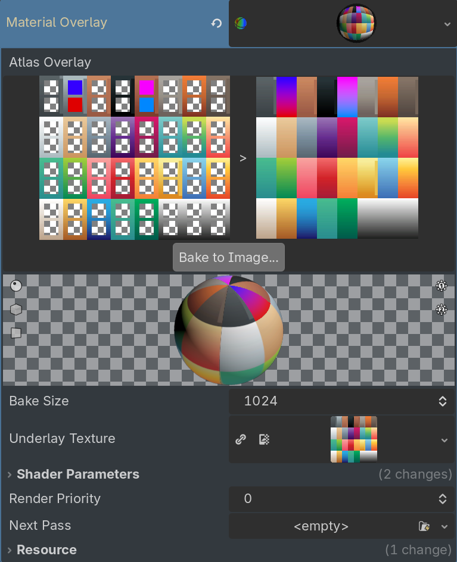

# Atlas Recolor

A Godot 4 editor plugin for recoloring atlas textures used by asset packs such as
[KayKit](https://kaylousberg.itch.io/), [TinyTreats](https://tinytreats.itch.io/) and [Kenney](https://kenney.nl/).

## Features

- **Custom `AtlasRecolorShader` type** — a `ShaderMaterial` that maps a grid of color pairs (light/dark) onto an atlas texture, letting you recolor individual regions with a gradient.
- **Texture Baking** - Allow for the baking of overlay textures out to an image for use in more complicated material applications.

## Installation

1. Copy the `addons/atlas_recolor` folder into your project's `addons/` directory.
2. In Godot, go to **Project → Project Settings → Plugins** and enable **AtlasRecolor**.

## Usage

1. Select a `MeshInstance3D` (or any node that accepts a `ShaderMaterial`).
2. Assign a new **AtlasRecolorShader** material to the **Material Overlay**, not override.
3. Set the **Underlay Texture** to your atlas texture for visualization and baking purposes (optional).
4. Use the inspector to adjust colors for each grid cell (8 columns × 4 rows, light + dark per cell).
5. Optionally bake the result to a static texture at the configured **Bake Size**.

## License

[MIT](LICENSE.md) Licensed.
